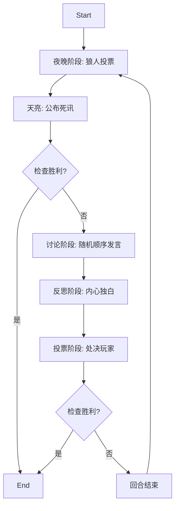

# 设计文档：多智能体狼人杀游戏系统 (v2.0)

## 1. 核心架构

本项目采用 **LangGraph** 作为核心编排框架，结合 **LangChain** 和 **ChromaDB** 构建了一个支持动态配置、拟人化交互的狼人杀模拟系统。

### 1.1 系统组件
1.  **`GameState` (Pydantic 模型):** 保存游戏的单一真实数据源，包括：
    *   `round` (回合数)
    *   `phase` (当前阶段)
    *   `players` (玩家列表及状态)
    *   `history` (全局对话历史)
    *   `winners` (获胜阵营)
    *   `recent_deaths` (最近死亡名单)
2.  **`Player` (Pydantic 模型):** 定义 Agent 属性：
    *   `name` (姓名)
    *   `role` (角色：villager/werewolf)
    *   `personality` (性格特征，如"多疑"、"激进"等)
    *   `status` (alive/dead)
3.  **`WerewolfGameAgent`:** 玩家智能体，负责：
    *   **发言 (`speak`):** 基于上下文和性格生成拟人化对话。
    *   **反思 (`reflect`):** 使用 Chain-of-Thought (`<think>`) 进行内心独白和推理。
    *   **投票 (`vote`):** 基于逻辑判断进行投票。
    *   **夜间行动 (`night_action`):** 狼人杀人决策。
4.  **`MemoryManager`:** 基于 ChromaDB 的 RAG 系统，用于存储和检索长期记忆。
5.  **`GameGraph`:** 定义游戏流程的状态机。

## 2. 游戏流程设计 (State Graph)

游戏循环通过 LangGraph 实现，节点流转如下：

### 关键机制：
*   **反思阶段 (Reflection):** 在投票前引入独立的思考步骤，强制 Agent 使用 `<think>` 标签进行内心推理。
    *   **村民逻辑:** 分析发言逻辑漏洞，寻找矛盾点。
    *   **狼人逻辑:** 评估伪装效果，策划栽赃或转移视线。
*   **胜利条件:**
    *   **村民胜利:** 所有狼人被出局。
    *   **狼人胜利 (屠边规则):** 狼人数量 >= 村民数量。

## 3. Agent 设计与拟人化

为了提升模拟的真实感，我们对 Prompt 进行了精细化设计：

### 3.1 动态性格与角色
*   **随机性格:** 每次游戏从预定义池中随机分配性格（如“谨慎且讲逻辑”、“情绪化且容易被煽动”），确保每局体验不同。
*   **角色差异化:**
    *   **村民 Prompt:** 强调逻辑分析，禁止无效的物理不在场证明（如“我昨晚在家睡觉”）。
    *   **狼人 Prompt:** 强调伪装、误导和团队配合，禁止“出戏”言论。

### 3.2 行为约束
*   **拟人化口语:** 强制要求使用自然口语（“嗯...”、“我觉得”），严禁机械化列表式发言。
*   **反破壁:** 严禁提及“AI”、“模拟”、“程序”等词汇，强制沉浸在游戏设定中。
*   **逻辑一致性:** 记忆模块确保 Agent 能基于之前的对话进行连贯的推理。

## 4. 配置与扩展性

系统支持高度可配置的运行模式：

*   **动态人数:** 支持 6-10 人游戏 (`--players N`)。
*   **动态狼人:** 支持自定义狼人数量 (`--wolves N`)。
*   **自动初始化:** 每次启动自动清理 ChromaDB 数据库，防止记忆污染。

## 5. 技术栈

*   **编排:** LangGraph, LangChain
*   **模型:** OpenAI GPT-4o-mini (通过 LangChain 调用)
*   **存储:** ChromaDB (本地向量存储)
*   **输出:** Rich (控制台美化), JSON 日志
*   **验证:** Pydantic (结构化输出验证)

## 6. 调试与日志

*   **控制台:** 实时输出带颜色的中文日志，清晰展示各阶段进展。
*   **结构化日志:** 游戏结束后生成 `game_log.json`，包含完整对话历史、Token 消耗和成本分析。
